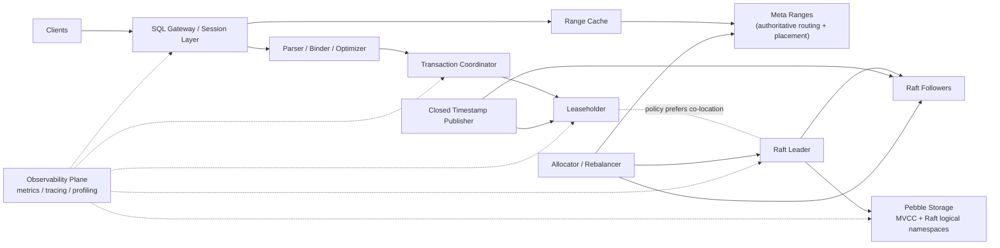
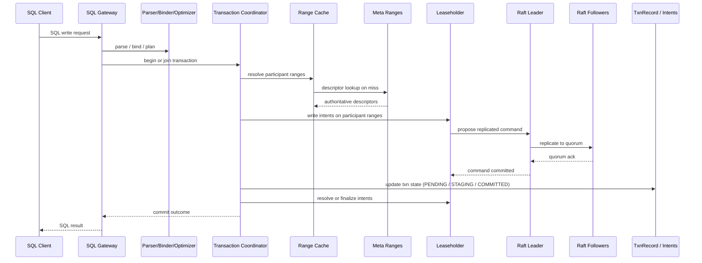
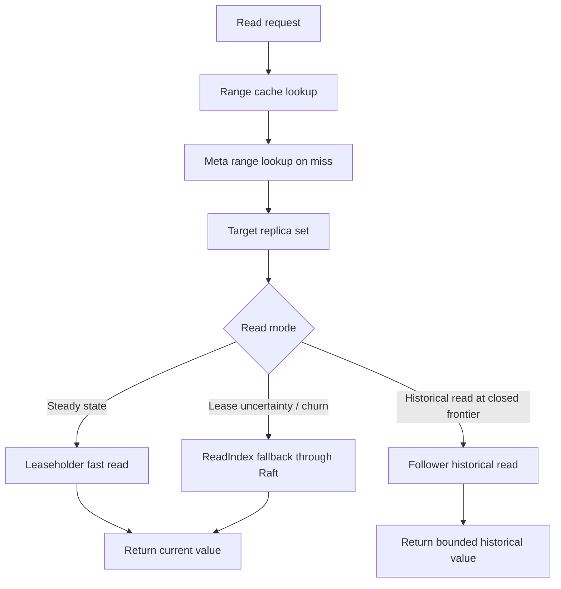

# ChronosDB

ChronosDB is a geo-distributed, strictly serializable SQL database built on a
replicated MVCC KV substrate.

Implementation is underway. The repository already contains:

- the Phase 0 protocol spec pack
- the Phase 1 Pebble-backed storage core
- the Phase 2 single-range replication and lease/read foundations
- the full Phase 3 through Phase 8 distributed systems core, locality, and hardening work
- the Phase 11 cluster console with live nodes, ranges, key lookup, events, and retained scenario browsing
- the Phase 12 topology drilldowns and the seeded `chronos-demo` cluster launcher
- the Phase 13 live runtime integration and seeded distributed SQL execution path
- the Phase 14 CRUD/app-compatibility surface, including `DELETE`, `UPDATE`, `UPSERT`, `ON CONFLICT`, extended pgwire, and a repeatable workload harness

The repo still follows a plan-first discipline: protocol and scope changes
should be written down before the corresponding code lands.

## Why ChronosDB Exists

ChronosDB aims to combine:

- SQL as the product interface
- strict serializability across ranges
- locality-aware placement for regional and multi-region workloads
- leaseholder-local fast reads in the steady state
- follower historical reads via closed timestamps
- online split, rebalance, repair, and distributed SQL execution

The design is explicit about the hard parts:

- leaseholder and Raft leader are **different concepts**
- routing truth comes from **meta ranges**, not gossip
- follower reads are **historical and freshness-bounded**, not arbitrary stale reads

## Core Guarantees

- No lost acknowledged writes
- Strict serializability under bounded clock skew
- Zone-failure survival by default; region-failure survival where configured
- Routing based on authoritative replicated metadata
- Parallel-commit-capable transaction model with `STAGING`
- Closed-timestamp-gated follower historical reads

## Detailed Architecture Diagram



## Request Flow Summary

### Write / Transaction Path



### Read Path



## Development Roadmap

1. **Phase 0**: freeze keyspace, state machines, retry contract, errors, closed timestamps, placement, and invariants. Status: complete.
2. **Phase 1**: Pebble-backed single-node storage core. Status: complete.
3. **Phase 2**: shared MultiRaft scheduler, lease system, fast reads, and durability batching. Status: complete.
4. **Phase 3**: meta ranges, routing, liveness, split, rebalance, and membership changes. Status: complete.
5. **Phase 4**: transaction core. Status: complete.
6. **Phase 5**: multi-range transactions, `STAGING`, and parallel commit. Status: complete.
7. **Phase 6**: PostgreSQL wire protocol and distributed SQL front door. Status: complete.
8. **Phase 7**: locality semantics and follower historical reads. Status: complete.
9. **Phase 8**: hardening, simulation, and external chaos runner integration. Status: complete for current scope.
10. **Phase 11**: cluster console and real-time operations UI. Status: complete.
11. **Phase 12**: topology drilldowns, operational forensics, and the seeded demo launcher. Status: complete.
12. **Phase 13**: live runtime integration and end-to-end SQL execution. Status: complete.
13. **Phase 14**: basic SQL CRUD and app compatibility. Status: complete.

## Quick Demo

Build the binaries and UI:

```bash
go build -o bin/chronos-demo ./cmd/chronos-demo
go build -o bin/chronos-node ./cmd/chronos-node
go build -o bin/chronos-console ./cmd/chronos-console
go build -o bin/chronos-appcompat ./cmd/chronos-appcompat
cd ui && npm install && npm run build && cd ..
```

Start the seeded 3-node cluster plus console:

```bash
./bin/chronos-demo -ui-dir ./ui/dist
```

Then open [http://127.0.0.1:8080](http://127.0.0.1:8080) and connect with:

```bash
PGPASSWORD=chronos psql "postgresql://chronos@127.0.0.1:26257/postgres?sslmode=disable"
```

Run the prepared-statement CRUD workload harness against the seeded cluster:

```bash
./bin/chronos-appcompat -pg-addr 127.0.0.1:26257 -user chronos -password chronos -iterations 10
```

Or have the seeded demo run it automatically on startup:

```bash
./bin/chronos-demo -ui-dir ./ui/dist -app-compat -app-compat-iterations 10
```

## Phase 8 Evidence

The in-repo Phase 8 closure work is now implemented and tested:

- the live local controller is in [`internal/systemtest/local_controller.go`](./internal/systemtest/local_controller.go)
- the external process-backed controller is in [`internal/systemtest/external_controller.go`](./internal/systemtest/external_controller.go)
- the lightweight node and runner binaries are in [`cmd/chronos-node/main.go`](./cmd/chronos-node/main.go) and [`cmd/chronos-chaos-runner/main.go`](./cmd/chronos-chaos-runner/main.go)
- the persistent artifact bundle is in [`internal/systemtest/artifacts.go`](./internal/systemtest/artifacts.go)
- the artifact assertion pack is in [`internal/systemtest/assertions.go`](./internal/systemtest/assertions.go)
- the built-in local fault matrix is in [`internal/systemtest/matrix.go`](./internal/systemtest/matrix.go) and exercised in [`internal/systemtest/matrix_test.go`](./internal/systemtest/matrix_test.go)
- the external process matrix path is exercised in [`internal/systemtest/external_controller_test.go`](./internal/systemtest/external_controller_test.go)
- the external handoff contract is documented in [`docs/systemtest/EXTERNAL_HANDOFF.md`](./docs/systemtest/EXTERNAL_HANDOFF.md)
- the operator dashboard and runbook docs live in [`docs/operations/DASHBOARDS.md`](./docs/operations/DASHBOARDS.md) and [`docs/operations/RUNBOOKS.md`](./docs/operations/RUNBOOKS.md)

Current decision:

- the Phase 8 closure plan is complete in-repo
- the top-level Phase 8 roadmap item is complete for the current project scope, because the repo now includes a simple external process runner that launches child node processes, consumes the handoff contract, and is covered by tests
- a full Jepsen implementation is still optional future hardening, not a prerequisite for this milestone

## Repository Contract

Current source-of-truth docs:

- [`ARCHITECTURE.md`](./ARCHITECTURE.md) explains the target system and rationale
- [`IMPLEMENTATION_PLAN.md`](./IMPLEMENTATION_PLAN.md) is the execution contract
- [`TODOS.md`](./TODOS.md) tracks the next concrete milestones
- [`rules.md`](./rules.md) defines the repo workflow rules
- [`docs/systemtest/EXTERNAL_HANDOFF.md`](./docs/systemtest/EXTERNAL_HANDOFF.md) defines the external chaos-runner mapping
- [`docs/operations/DASHBOARDS.md`](./docs/operations/DASHBOARDS.md) and [`docs/operations/RUNBOOKS.md`](./docs/operations/RUNBOOKS.md) define the Phase 8 operator view

Implementation rule:

- if code needs a protocol or scope change not already written down, update
  `IMPLEMENTATION_PLAN.md` first in a docs commit, then write code
- push directly to `main` unless a PR is explicitly requested
