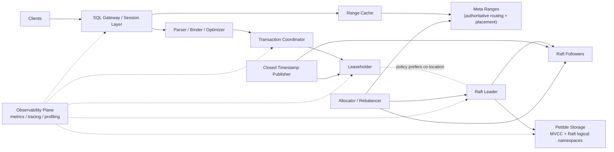
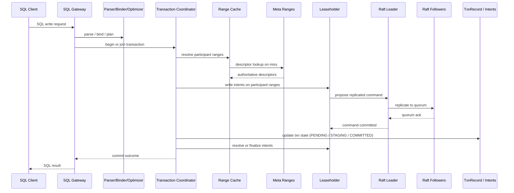
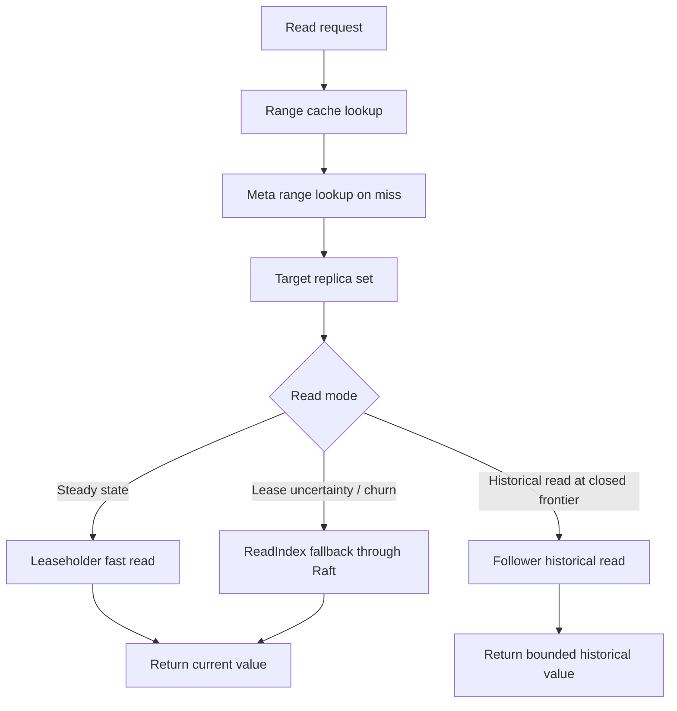

# ChronosDB

ChronosDB is a geo-distributed, strictly serializable SQL database built on a
replicated MVCC KV substrate.

This repository is intentionally **docs-first** right now. The architecture,
execution contract, and roadmap are being frozen before any implementation code
lands so the system does not drift into accidental shortcuts.

## Why ChronosDB Exists

ChronosDB aims to combine:

- SQL as the product interface
- strict serializability across ranges
- locality-aware placement for regional and multi-region workloads
- leaseholder-local fast reads in the steady state
- follower historical reads via closed timestamps
- online split, rebalance, repair, and distributed SQL execution

The design is explicit about the hard parts:

- leaseholder and Raft leader are **different concepts**
- routing truth comes from **meta ranges**, not gossip
- follower reads are **historical and freshness-bounded**, not arbitrary stale reads

## Core Guarantees

- No lost acknowledged writes
- Strict serializability under bounded clock skew
- Zone-failure survival by default; region-failure survival where configured
- Routing based on authoritative replicated metadata
- Parallel-commit-capable transaction model with `STAGING`
- Closed-timestamp-gated follower historical reads

## Detailed Architecture Diagram

## Request Flow Summary

### Write / Transaction Path

### Read Path

## Development Roadmap

1. **Phase 0**: freeze keyspace, state machines, retry contract, errors, closed timestamps, placement, and invariants
2. **Phase 1**: Pebble-backed single-node storage core
3. **Phase 2**: shared MultiRaft scheduler, lease system, fast reads, and durability batching
4. **Phase 3**: meta ranges, routing, liveness, split, rebalance, and membership changes
5. **Phase 4**: transaction core
6. **Phase 5**: multi-range transactions, `STAGING`, and parallel commit
7. **Phase 6**: PostgreSQL wire protocol and distributed SQL front door
8. **Phase 7**: locality semantics and follower historical reads
9. **Phase 8**: hardening, large-scale simulation, and chaos/Jepsen testing

## Repository Contract

Before any code lands:

- [`ARCHITECTURE.md`](./ARCHITECTURE.md) explains the target system and rationale
- [`IMPLEMENTATION_PLAN.md`](./IMPLEMENTATION_PLAN.md) is the execution contract
- [`TODOS.md`](./TODOS.md) tracks the next concrete milestones
- [`rules.md`](./rules.md) stores persistent Codex/agent workflow rules

Implementation rule:

- if code needs a protocol or scope change not already written down, update
  `IMPLEMENTATION_PLAN.md` first in a docs commit, then write code

Git workflow rule:

- agent-generated changes should land through pull requests instead of direct
  pushes to `main`; a new branch is not required for every task, and work can
  continue after the PR is opened while review happens asynchronously
