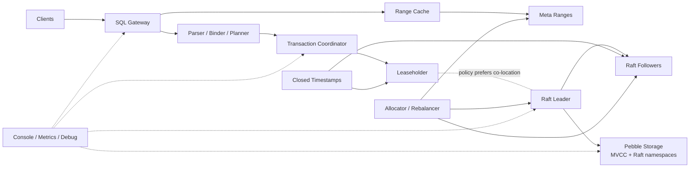

# ChronosDB

ChronosDB is a geo-distributed SQL database built on a replicated MVCC KV
substrate. It combines PostgreSQL-compatible client access, strict
serializability, locality-aware placement, leaseholder-local reads, follower
historical reads, and a live operations console.

## Highlights

- Strictly serializable reads and writes
- Replicated MVCC storage on Pebble
- Multi-range transactions with intents, `STAGING`, and parallel-commit recovery
- Leaseholder fast reads with `ReadIndex` fallback
- Closed-timestamp follower historical reads
- Online split, rebalance, learner snapshot catch-up, and repair flows
- PostgreSQL wire protocol with CRUD, `UPSERT`, `ON CONFLICT`, explicit
  transactions, and prepared-statement support
- Real-time cluster console for nodes, ranges, topology, key location, events,
  and retained scenario runs
- Local chaos and app-compat runners for repeatable validation

## Architecture



Design invariants:

- leaseholder and Raft leader are different concepts
- routing truth comes from replicated meta ranges, not gossip
- follower reads are historical and bounded by closed timestamps

## SQL Surface

ChronosDB currently supports the core application path:

- `SELECT`
- `INSERT`
- `UPDATE`
- `DELETE`
- `UPSERT`
- `INSERT ... ON CONFLICT`
- `BEGIN`, `COMMIT`, `ROLLBACK`
- prepared statements over pgwire

The seeded demo ships with a small built-in catalog for `users` and `orders`
so the cluster can be exercised immediately.

## Quick Start

Build the binaries and UI:

```bash
go build -o bin/chronos-demo ./cmd/chronos-demo
go build -o bin/chronos-node ./cmd/chronos-node
go build -o bin/chronos-console ./cmd/chronos-console
go build -o bin/chronos-appcompat ./cmd/chronos-appcompat
go build -o bin/chronos-chaos-runner ./cmd/chronos-chaos-runner
cd ui && npm install && npm run build && cd ..
```

Start the seeded three-node cluster and console:

```bash
./bin/chronos-demo -ui-dir ./ui/dist
```

Open the console:

- [http://127.0.0.1:8080](http://127.0.0.1:8080)

Connect with `psql` using the demo credentials:

```bash
PGPASSWORD=chronos psql "postgresql://chronos@127.0.0.1:26257/postgres?sslmode=disable"
```

Run the prepared-statement CRUD workload harness:

```bash
./bin/chronos-appcompat -pg-addr 127.0.0.1:26257 -user chronos -password chronos -iterations 10
```

Run the local chaos harness:

```bash
./bin/chronos-chaos-runner -node-binary ./bin/chronos-node -artifact-root .artifacts/chaos
```

## Manual Node Startup

To run nodes directly instead of the seeded launcher:

```bash
./bin/chronos-node \
  -node-id 1 \
  -data-dir .demo/node1 \
  -pg-addr 127.0.0.1:26257 \
  -obs-addr 127.0.0.1:18081 \
  -control-addr 127.0.0.1:19081 \
  -pg-user chronos \
  -pg-password chronos
```

Repeat with unique node IDs, ports, and data directories for additional nodes.

## Operations Surface

ChronosDB exposes:

- PostgreSQL wire protocol for application traffic
- the cluster console for live topology and event inspection
- observability and debug HTTP surfaces on each node
- retained chaos artifacts and scenario drilldowns through the console API

For local demos, the default credentials are:

- user: `chronos`
- password: `chronos`

## Validation

Run the full Go test suite:

```bash
go test ./...
```

Build and test the UI:

```bash
cd ui
npm test
npm run build
cd ..
```

## Repository Guide

- [ARCHITECTURE.md](./ARCHITECTURE.md): system architecture and invariants
- [docs/systemtest/EXTERNAL_HANDOFF.md](./docs/systemtest/EXTERNAL_HANDOFF.md): external chaos-runner contract
- [docs/operations/DASHBOARDS.md](./docs/operations/DASHBOARDS.md): metrics and dashboard guide
- [docs/operations/RUNBOOKS.md](./docs/operations/RUNBOOKS.md): operational runbooks

